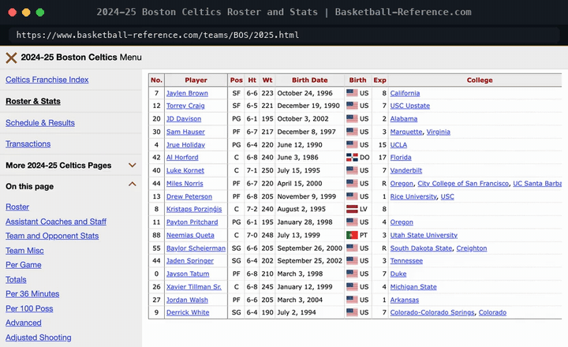

<h1 align="center">NBA Playoff Roster Database</h1>

<p align="center">Scrape the 2024-25 rosters of the NBA playoff teams and load them into a queryable MySQL schema.</p>

<p align="center">
  <a href="#features">Features</a> ·
  <a href="#quick-start">Quick start</a> ·
  <a href="#how-it-works">How it works</a> ·
  <a href="#project-notes">Project notes</a>
</p>

<p align="center">
  
  
</p>

<p align="center">
  
</p>

This Python command-line tool parses team roster tables from Basketball Reference and loads player and team rows into MySQL. I built it to make the 2024-25 rosters of the playoff teams easy to inspect and query with SQL. It takes each team's full season roster table, not only the players who appeared in the playoffs. Its scope is roster data only; it does not collect schedules, games, box scores, or playoff statistics.

## Features

- **Roster extraction.** Select configured 2025 playoff teams, fetch their roster pages, and parse player identifiers, names, jersey numbers, positions, measurements, birth dates, nationality, experience, and college.
- **Normalized MySQL schema.** Store team-season records separately from players, linked by a foreign key.
- **Repeat-safe loading.** Unique keys and `ON DUPLICATE KEY UPDATE` statements update matching team and player rows instead of inserting duplicates.
- **Flexible inputs.** Choose teams, control the request delay, load a saved HTML page, or print parsed rows without writing to MySQL.
- **SQL-ready output.** The demo loads BOS and NYK, then queries roster counts and player positions from the local database.

## Quick start

Prerequisites: Python 3.10 or newer, MySQL 8 or newer, and network access to Basketball Reference for live scraping.

```bash
git clone https://github.com/cl0ax/NBA-Playoff-Database.git
cd NBA-Playoff-Database
python3 -m venv .venv
source .venv/bin/activate
python -m pip install -r requirements.txt
```

Set database connection values in your shell. The MySQL user needs permission to create the selected database and its tables.

```bash
export NBA_DB_HOST=127.0.0.1
export NBA_DB_PORT=3306
export NBA_DB_USER=your_user
export NBA_DB_PASSWORD=your_password
```

Load the Boston and New York rosters into a database named `nba_demo`:

```bash
python RosterScraper.py --teams BOS,NYK --database nba_demo
```

That command completed successfully in the demo run shown above. The script creates the database if needed. The database argument overrides `NBA_DB_NAME`, which otherwise defaults to `nba_playoff_rosters`.

Query the loaded rows:

```bash
mysql -h "$NBA_DB_HOST" -P "$NBA_DB_PORT" -u "$NBA_DB_USER" -p nba_demo -e "SELECT 'teams' t, COUNT(*) n FROM teams UNION ALL SELECT 'players', COUNT(*) FROM players; SELECT t.abbr, p.name, p.position FROM players p JOIN teams t USING (team_id) LIMIT 6;"
```

To parse without loading MySQL, add `--no-load`. To use a locally saved roster page when a live request is blocked, pass one team and `--html-file /path/to/TEAM-2025.html`.

## How it works

`RosterScraper.py` maps selected abbreviations to 2025 playoff teams, fetches each Basketball Reference roster page with a shared `requests.Session`, and uses Beautiful Soup with `lxml` to extract the roster table. pandas holds the parsed rows and normalizes dates and weights. The MySQL loader creates `teams` and `players`, links players by `team_id`, and upserts rows using unique keys. The CLI is in the same file; dependencies are pinned in `requirements.txt`.

## Project notes

This started as a three-person class project with [dschober02](https://github.com/dschober02), who wrote the first prototype scraper, and Erik, who worked on the database side. I rewrote it into what is here now: the parser, the MySQL schema and upsert loader, the environment-based configuration and the command-line options.

The data covers the configured playoff teams' 2024-25 season rosters. Live scraping can fail when Basketball Reference returns HTTP 403 or changes its page structure; a saved-page input is available as a fallback. The loader checks table and row counts after loading, but does not independently verify the historical accuracy of the source data. There is no automated test suite in the repository.

License: [MIT](LICENSE).
